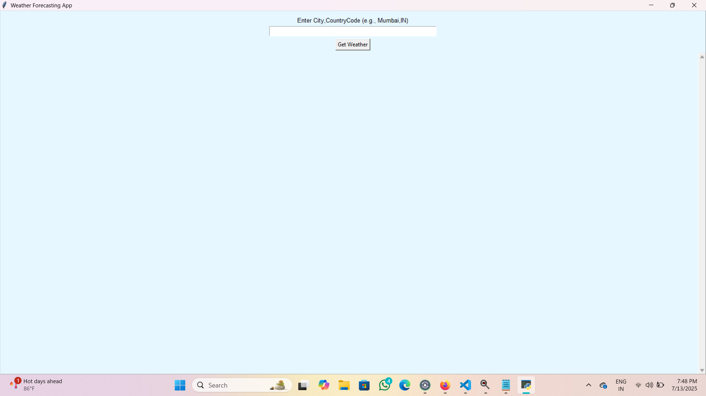
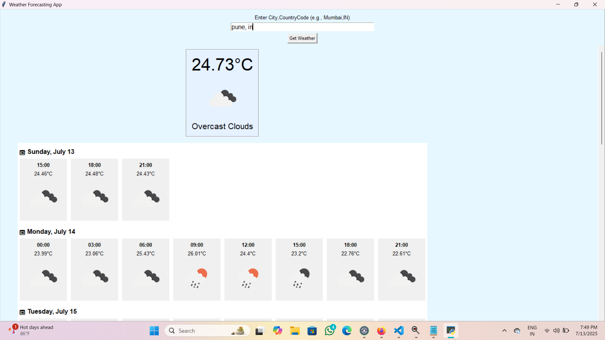
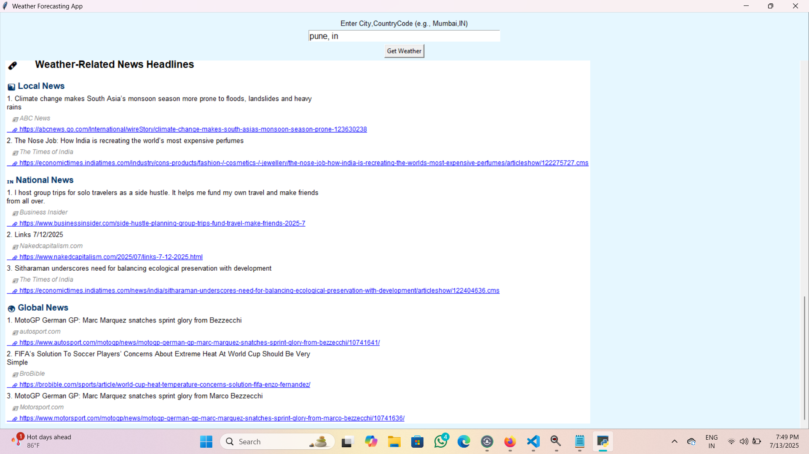

# 🌤️ Weather Forecasting App

A desktop application built using **Python (Tkinter)** to display current weather, hourly forecast, and weather-related news using live data from **OpenWeatherMap API** and **NewsAPI**.

---

## 📸 Features

- 🌡️ **Current Weather**: Shows temperature, weather condition, and icon.
- 🕒 **5-Day Hourly Forecast**: Displays hourly temperature and icon per day in a horizontal layout.
- 🗞️ **Weather News**: Fetches and categorizes top 3 headlines each from local, national, and global sources.
- 🔍 **City Search**: Supports input in the format `City,CountryCode` (e.g., `Mumbai,IN`).
- 🖱️ **Scrollable UI**: Allows easy navigation of forecasts and news.
- 🌐 **Clickable News Links**: Opens news articles in your default browser.

---

## 🧱 Tech Stack

- **Python 3**
- **Tkinter** for GUI
- **Pillow (PIL)** for image handling
- **Requests** for API calls
- **OpenWeatherMap API**
- **NewsAPI**

---

## 🗂️ File Structure
```
weather_app/
├── weather_gui.py # Main GUI interface
├── weather_backend.py # Handles API requests and data formatting
└── README.md # Project overview (this file)
```

---

## ⚙️ Installation

1. **Clone the repository**
   ```bash
   git clone https://github.com/your-username/weather-app.git
   cd weather-app

2. **Install required packages**
   ```bash
   pip install requests Pillow

3. **Add your API keys**
   Replace the placeholders in weather_backend.py:
   ```bash
   API_KEY = "your_openweathermap_api_key"
   NEWS_API_KEY = "your_newsapi_key" 

---

## 🚀 Usage

1. Run the app:
```
python weather_gui.py
```

2. Enter the city and country code (e.g., Mumbai,IN) in the input field.

3. Click **"Get Weather"** to view:

   a) The current weather

   b) 5-day hourly forecast

   c) Related news

---

## 📷 Screenshot
- 

- 

- 

